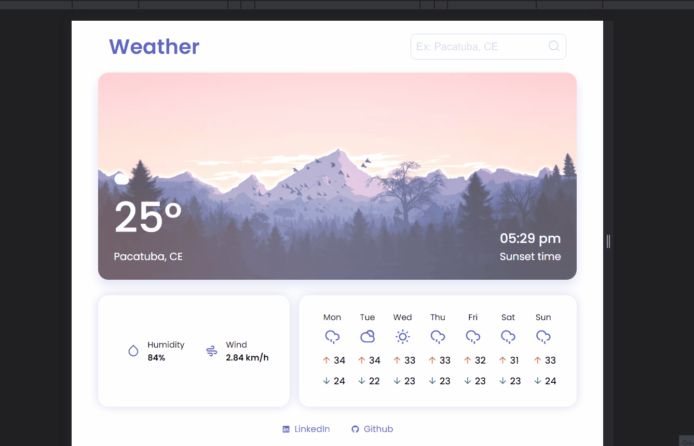

# weather-dashboard




> O projeto trata-se de uma dashboard do tempo. Nele, você será capaz de pesquisar por uma localidade e acompanhar a previsão do tempo. Esse projeto está sendo desenvolvido com as tecnologia <strong>HTML5</strong>, <strong>CSS3</strong> e <strong>Javascript</strong>.

### Ajustes e melhorias

O projeto ainda está em desenvolvimento e as próximas atualizações serão voltadas nas seguintes tarefas:

- [X] Design
- [X] Resposividade
- [X] Funcionalidades


## 💻 Pré-requisitos

Antes de começar, verifique se você atendeu aos seguintes requisitos:

* Navegador `<Google Chrome / Firefox / Microsoft Edge>`
* Extensão `<CORS Unblock>`

## 🚀 Instalando o Moesif CORS
Vá na loja de extensões do seu navegador e pesquise por Moesif e instale (Ele irá permitir acesso a api de clima - OpenWeather)

## 🚀 Instalando o weather-dashboard

Para instalar o weather-dashboard, siga estas etapas:

Linux, macOS e Windows:
```
git clone https://github.com/devCleidison/weather-dashboard.git
```

ou baixe o arquivo compactado diretamente pelo link:
```
https://github.com/devCleidison/weather-dashboard/archive/refs/heads/main.zip
```

## ☕ Usando o weather-dashboard

Para usar o weather-dashboard, siga estas etapas:

```
Abra a pasta do projeto e execute o arquivo index.html dando 2 cliques
```

Após, basta permitir acesso a sua localização

## 🚀 Quer testar antes?
* [Clique aqui!](https://devcleidison-weather-dashboard.netlify.app/)

## 📫 Contribuindo para o weather-dashboard

Para contribuir com o weather-dashboard, siga estas etapas:

1. Bifurque este repositório.
2. Crie um branch: `git checkout -b <nome_branch>`.
3. Faça suas alterações e confirme-as: `git commit -m '<mensagem_commit>'`
4. Envie para o branch original: `git push origin <nome_do_projeto> / <local>`
5. Crie a solicitação de pull.

Como alternativa, consulte a documentação do GitHub em [como criar uma solicitação pull](https://help.github.com/en/github/collaborating-with-issues-and-pull-requests/creating-a-pull-request).

## 🤝 Inspiração


<table>
  <tr>
    <td align="center">
      <a href="https://www.youtube.com/c/DesignSense">
        <br>
        <sub>
          <b>DesignSense</b>
        </sub>
      </a>
    </td>
  </tr>
</table>

[⬆ Voltar ao topo](#weather-dashboard)<br>